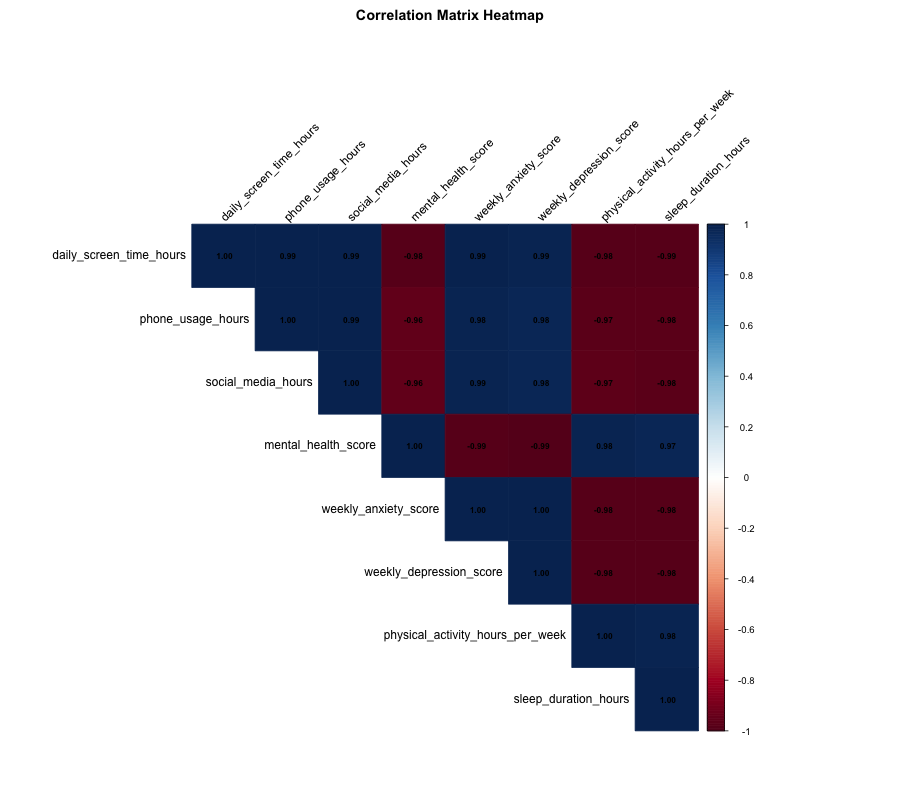
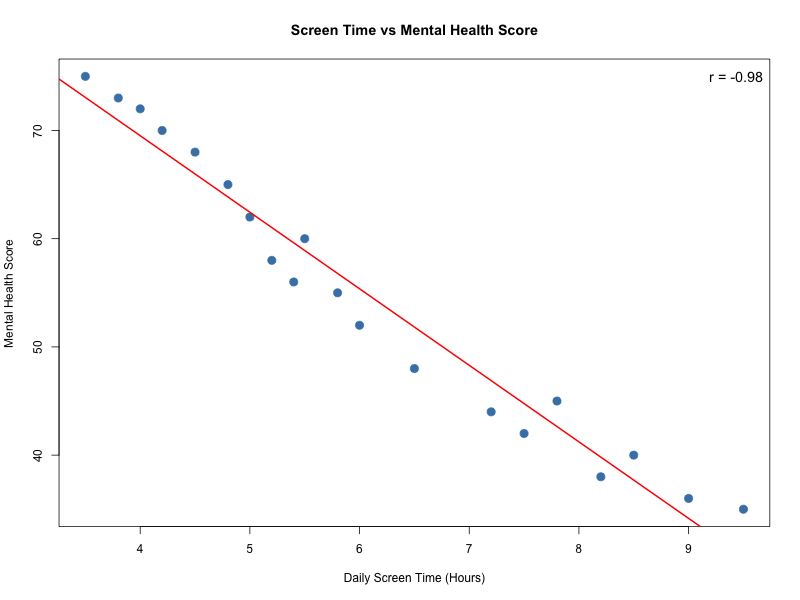

# 📊 Impact of Screen Time on Mental Health - R Analysis Project

## Overview
This project analyzes the relationship between screen time and mental health using statistical methods in R. It includes descriptive statistics, correlation analysis, normality tests, regression analysis, and an interactive Shiny dashboard.

## 📂 Project Structure

```
Mental_Health_Analysis/
├── data/
│   └── digital_diet_mental_health.csv    # Dataset with 20 observations
├── scripts/
│   └── analysis.R                         # Main analysis script
├── output/
│   ├── scatter_screentime_mentalhealth.png
│   ├── scatter_activity_mentalhealth.png
│   ├── scatter_screentime_anxiety.png
│   ├── correlation_heatmap.png
│   ├── histogram_screentime.png
│   └── histogram_mentalhealth.png
├── app.R                                  # Shiny Dashboard
├── .gitignore
└── README.md
```

## 📈 Variables in Dataset

| Variable | Description |
|----------|-------------|
| `user_id` | Unique identifier |
| `age` | Age of participant |
| `gender` | Male/Female |
| `location` | Urban/Suburban/Rural |
| `daily_screen_time_hours` | Daily screen time in hours |
| `phone_usage_hours` | Phone usage in hours |
| `social_media_hours` | Social media usage in hours |
| `sleep_duration_hours` | Sleep duration in hours |
| `physical_activity_hours_per_week` | Weekly physical activity |
| `mindfulness_minutes_per_day` | Daily mindfulness minutes |
| `mental_health_score` | Mental health score (higher = better) |
| `weekly_anxiety_score` | Anxiety score (lower = better) |
| `weekly_depression_score` | Depression score (lower = better) |

## 🔬 Analysis Included

1. **Descriptive Statistics** - Mean, SD, Min, Max for all variables
2. **Correlation Analysis** - Correlation matrix and heatmap
3. **Normality Tests** - Shapiro-Wilk tests for all variables
4. **Regression Analysis** - Simple and multiple linear regression
5. **Visualizations** - Scatter plots with regression lines, histograms

## 📊 Key Findings

| Correlation | Value | Interpretation |
|-------------|-------|----------------|
| Screen Time vs Mental Health | -0.98 | Strong negative correlation |
| Screen Time vs Anxiety | 0.99 | Strong positive correlation |
| Screen Time vs Depression | 0.99 | Strong positive correlation |
| Physical Activity vs Mental Health | 0.98 | Strong positive correlation |

## 🚀 How to Run

### Prerequisites
Install required R packages:
```r
install.packages(c("ggplot2", "dplyr", "corrplot", "psych", "shiny", "shinydashboard", "DT"))
```

### Run Analysis Script
```r
setwd("path/to/Mental_Health_Analysis")
source("scripts/analysis.R")
```

### Run Shiny Dashboard
```r
setwd("path/to/Mental_Health_Analysis")
shiny::runApp("app.R")
```

## 🖼️ Screenshots

### Correlation Heatmap


### Screen Time vs Mental Health


## 📝 Author
[Ali Sadiq]

## 📅 Date
January 2026

## 📜 License
This project is for educational purposes.
